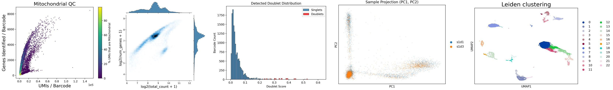
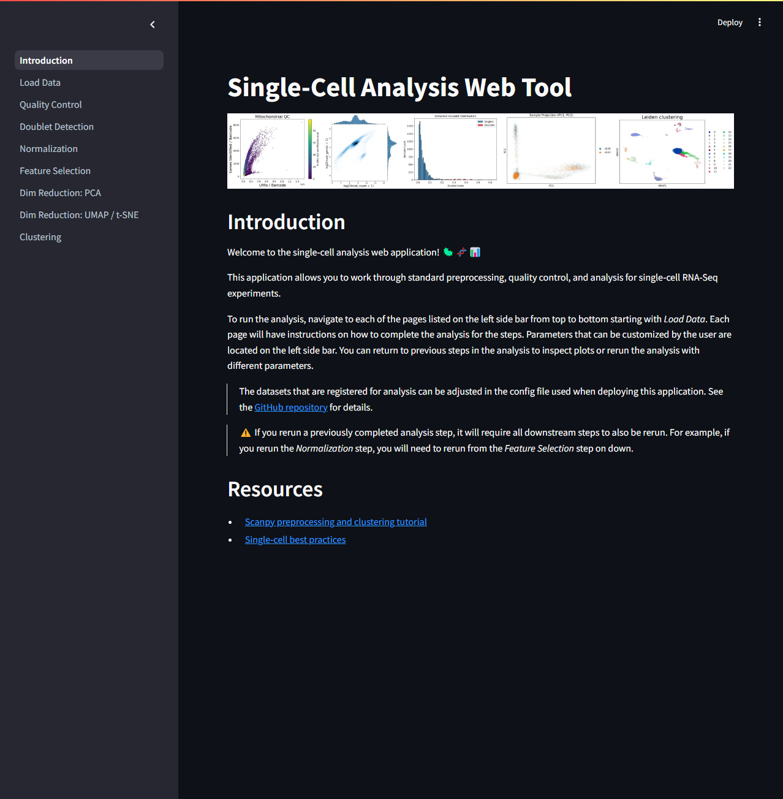
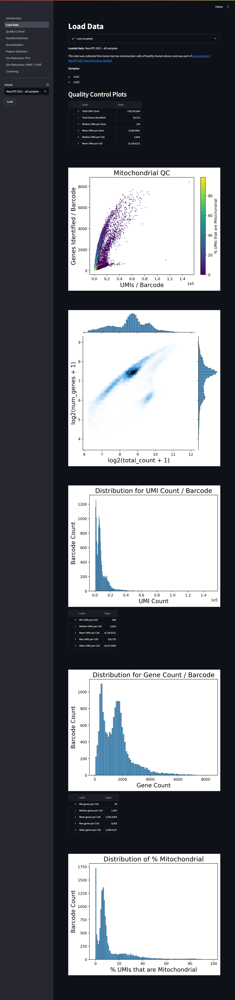
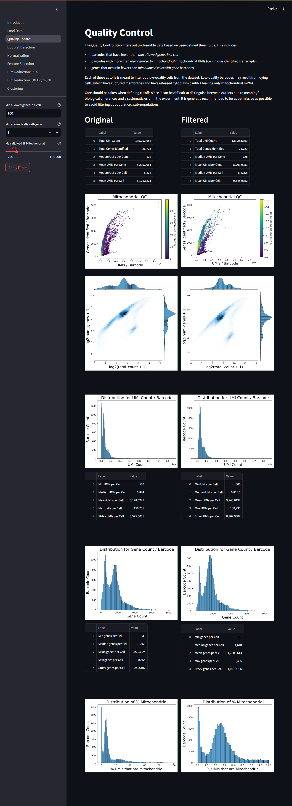
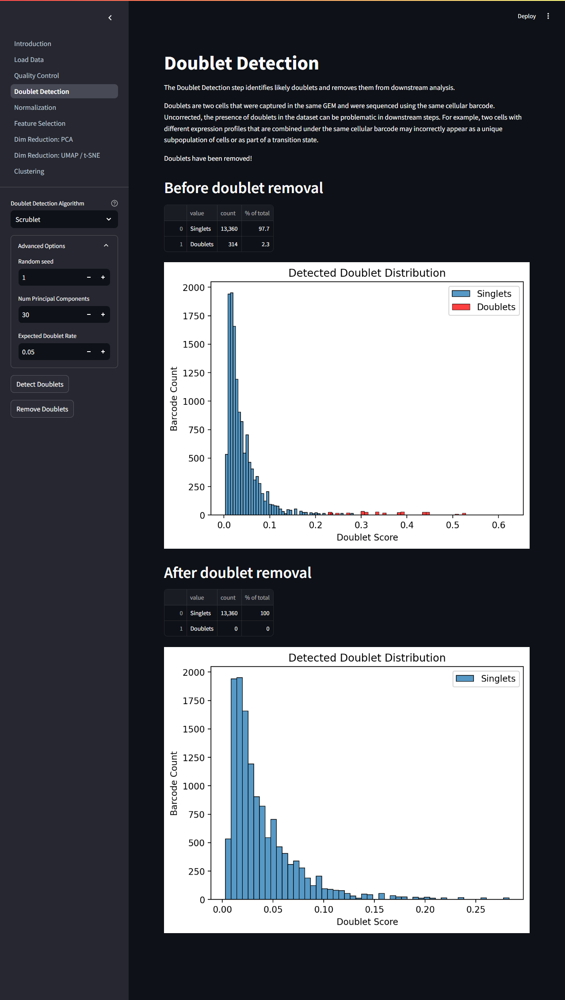
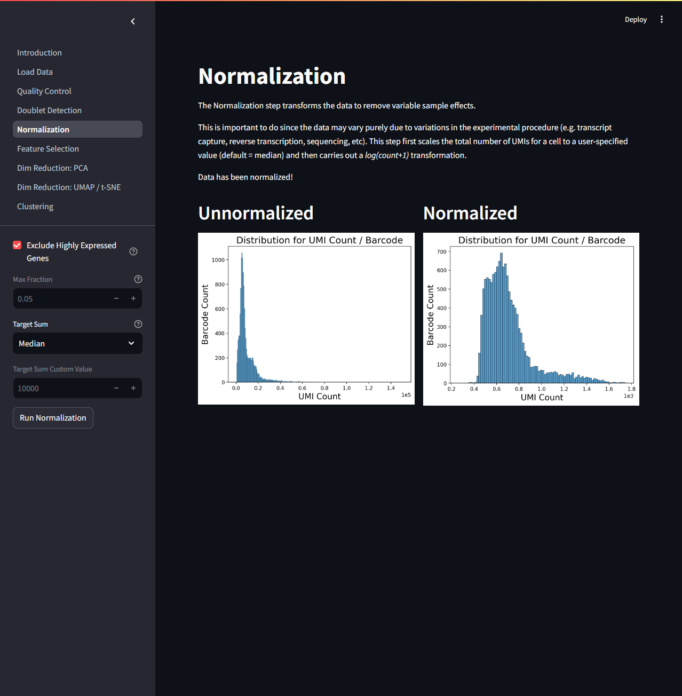
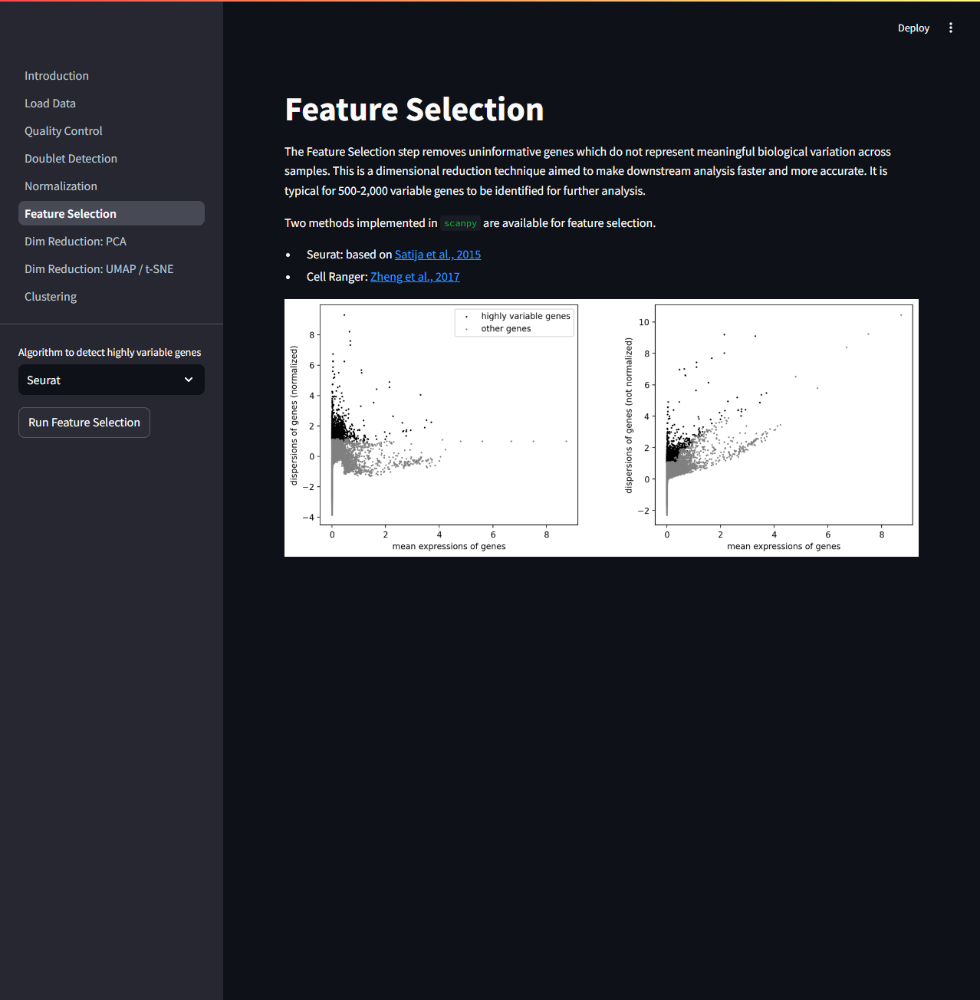
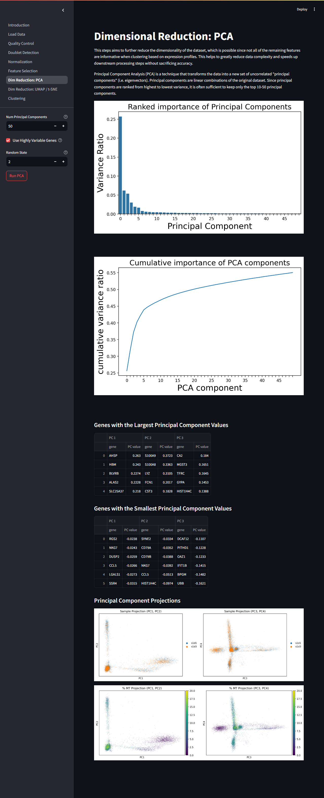
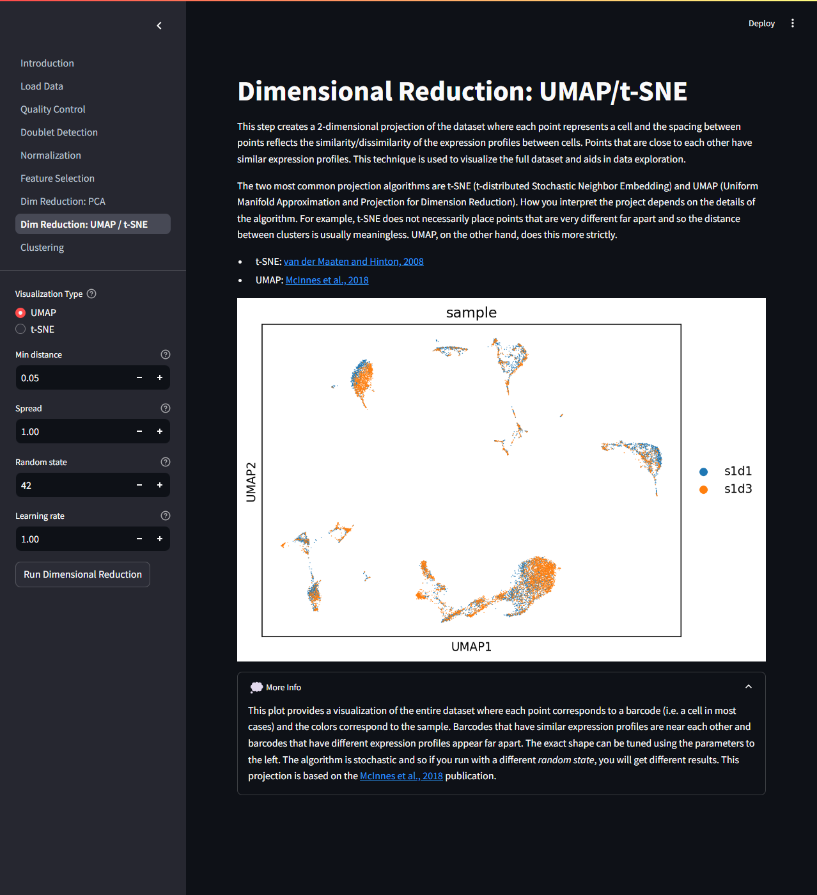
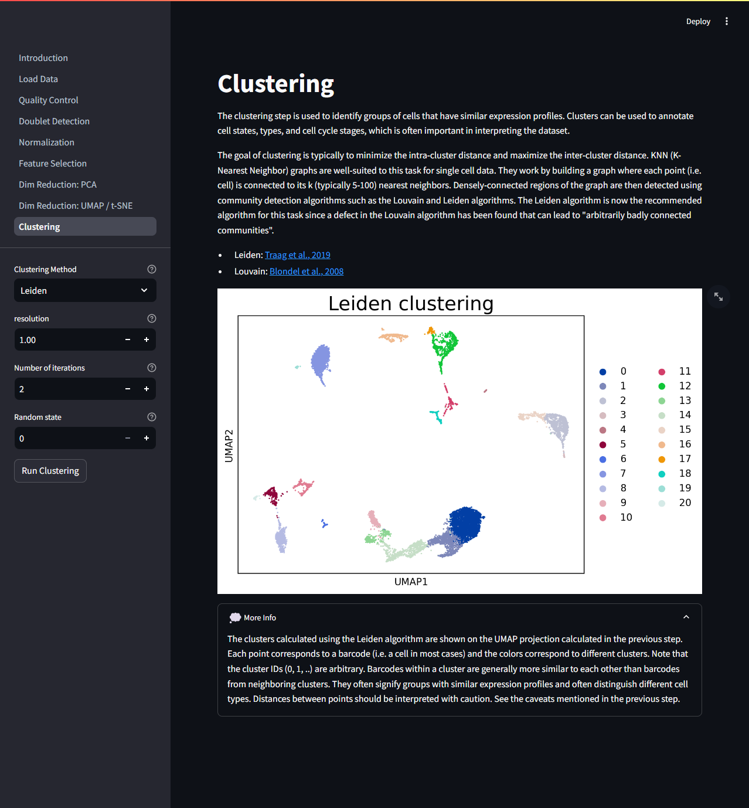

# Overview

This is a single cell analysis web application built with `scanpy` and `streamlit`.  It provides a simple, customizable user interface for the common scRNA-Seq preprocessing and analysis tasks.  

- [Setup](#setup)
- [Running](#running)
- [Screenshots](#screenshots)
- [Deployment](#deployment)

https://github.com/user-attachments/assets/858cd95f-9900-4ded-a33f-f9ccb18e345c

A demo version has been deployed to Azure and is available at [https://mattperkett.com/single-cell/](https://mattperkett.com/single-cell/). See the [Screenshots](#screenshots) section for an overview of the different preprocessing and analysis tasks implemented.

- Loading Data
- Quality Control
- Doublet Detection
- Normalization
- Feature Selection
- Dimensional Reduction: PCA
- Dimensional Reduction: UMAP / t-SNE
- Clustering

# Setup

Instructions are provided to set up the web application to run locally with the `pyenv` virtual environment manager or using `Docker`.  Regardless of whether you will run the web application using `pyenv` or `Docker`, you will also need to download example single cell data and create a config file. 

## pyenv

```shell
# clone the repo
git clone https://github.com/mrperkett/single-cell-streamlit.git
cd single-cell-streamlit

# set up a new virtual environment
pyenv virtualenv 3.11.7 single-cell-streamlit
pyenv local single-cell-streamlit

# install requirements
python3 -m pip install --upgrade pip
python3 -m pip install -r requirements.txt
```

## Docker

```shell
# clone the repo
git clone https://github.com/mrperkett/single-cell-streamlit.git
cd single-cell-streamlit

# build the docker image
docker build --rm -t single-cell-streamlit -f Dockerfile .
```

## Download example data

The easiest way to download the example files is to run the provided `download_example_files.py` script using the pyenv virtual environment created earlier.

```shell
# download data
python3 ./scripts/download_example_files.py
```

After downloading the data, a config file must be generated.  You can customize the datasets that can be analyzed by editing the `datasets` portion of the `yaml` config file.  Example config files are provided below.

### Example config when running with `pyenv`

`config.yaml`

```yaml
datasets:
  "NeurIPS 2021 - all samples":
    description: "This data was collected from bone marrow mononuclear cells of healthy human donors and was part of [openproblem's NeurIPS 2021 benchmarking dataset](https://openproblems.bio/competitions/neurips_2021/)"
    samples:
      s1d1: "/home/mperkett/.cache/scverse_tutorials/s1d1_filtered_feature_bc_matrix.h5"
      s1d3: "/home/mperkett/.cache/scverse_tutorials/s1d3_filtered_feature_bc_matrix.h5"
  "NeurIPS 2021 - sample 1":
    description: "This data was collected from bone marrow mononuclear cells of healthy human donors and was part of [openproblem's NeurIPS 2021 benchmarking dataset](https://openproblems.bio/competitions/neurips_2021/)"
    samples:
      s1d1: "/home/mperkett/.cache/scverse_tutorials/s1d1_filtered_feature_bc_matrix.h5"
  "NeurIPS 2021 - sample 2":
    description: "This data was collected from bone marrow mononuclear cells of healthy human donors and was part of [openproblem's NeurIPS 2021 benchmarking dataset](https://openproblems.bio/competitions/neurips_2021/)"
    samples:
      s1d3: "/home/mperkett/.cache/scverse_tutorials/s1d3_filtered_feature_bc_matrix.h5"
```

### Example config when running with `Docker`

When generating the config file for running with Docker, note that file paths will be relative to the mounted volume, which is `/data` in the example below.

`config-docker.yaml`

```yaml
datasets:
  "NeurIPS 2021 - all samples":
    description: "This data was collected from bone marrow mononuclear cells of healthy human donors and was part of [openproblem's NeurIPS 2021 benchmarking dataset](https://openproblems.bio/competitions/neurips_2021/)"
    samples:
      s1d1: "/data/s1d1_filtered_feature_bc_matrix.h5"
      s1d3: "/data/s1d3_filtered_feature_bc_matrix.h5"
  "NeurIPS 2021 - sample 1":
    description: "This data was collected from bone marrow mononuclear cells of healthy human donors and was part of [openproblem's NeurIPS 2021 benchmarking dataset](https://openproblems.bio/competitions/neurips_2021/)"
    samples:
      s1d1: "/data/s1d1_filtered_feature_bc_matrix.h5"
  "NeurIPS 2021 - sample 2":
    description: "This data was collected from bone marrow mononuclear cells of healthy human donors and was part of [openproblem's NeurIPS 2021 benchmarking dataset](https://openproblems.bio/competitions/neurips_2021/)"
    samples:
      s1d3: "/data/s1d3_filtered_feature_bc_matrix.h5"
```

# Running

## pyenv

```shell
$ python3 -m streamlit run app.py

Collecting usage statistics. To deactivate, set browser.gatherUsageStats to false.


  You can now view your Streamlit app in your browser.

  URL: http://0.0.0.0:8505
```

View the web application at the URL printed in the terminal (by default [http://localhost:8501/](http://localhost:8501/)).

## Docker

```shell
$ port=8501
$ data_dir="/home/mperkett/.cache/scverse_tutorials"
$ config_file="/home/mperkett/projects/single-cell-streamlit/config-docker.yaml"
$ docker run -e port=${port} -p ${port}:${port} -it --rm -v "${data_dir}":/data -v "${config_file}":"/app/config.yaml" single-cell-streamlit

Collecting usage statistics. To deactivate, set browser.gatherUsageStats to false.


  You can now view your Streamlit app in your browser.

  URL: http://0.0.0.0:8505
```

View the web application at the URL printed in the terminal (by default [http://localhost:8501/](http://localhost:8501/)).


# Screenshots

## Introduction



## Loading Data




## Quality Control




## Doublet Detection




## Normalization




## Feature Selection




## Dimensional Reduction: PCA




## Dimensional Reduction: UMAP / t-SNE




## Clustering




# Deployment
